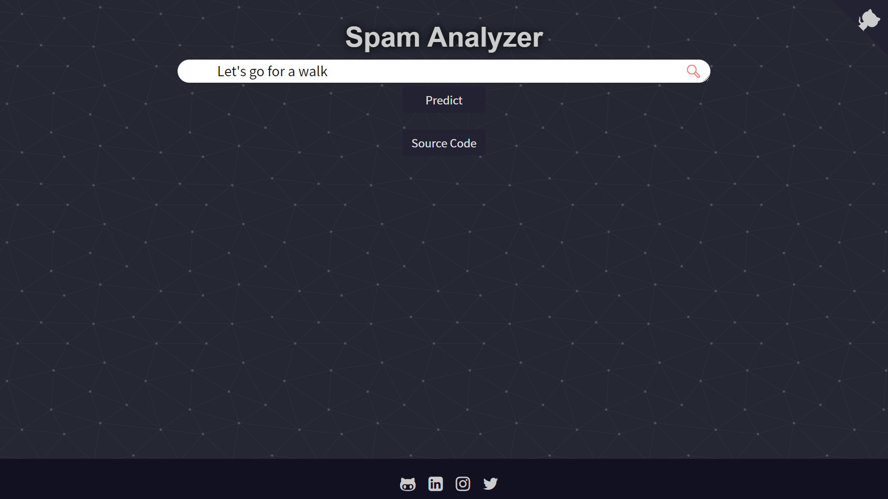
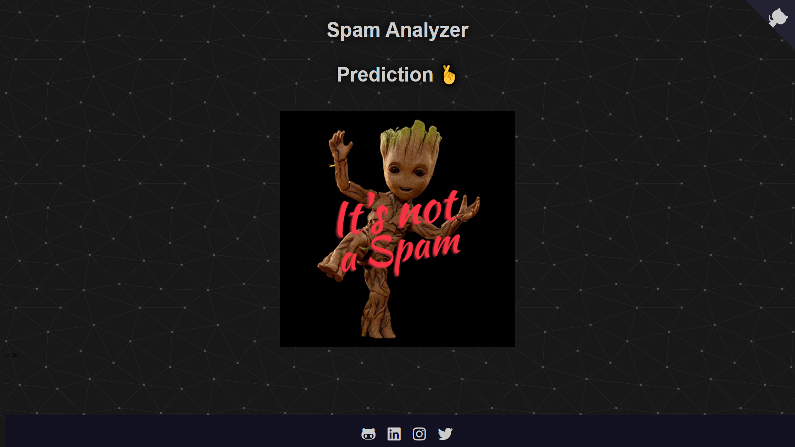
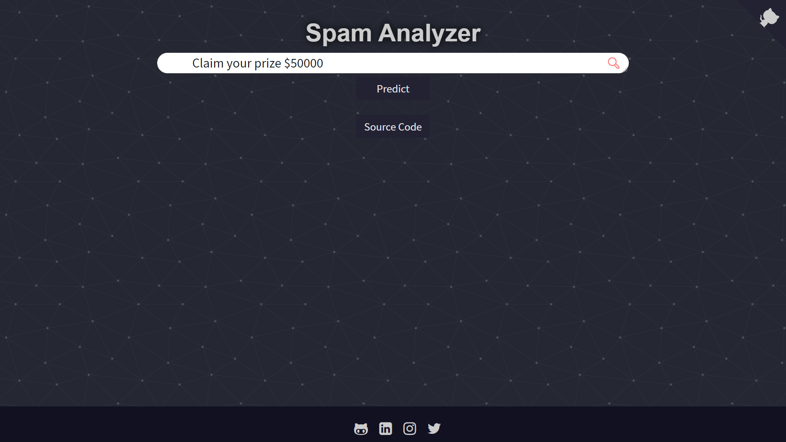
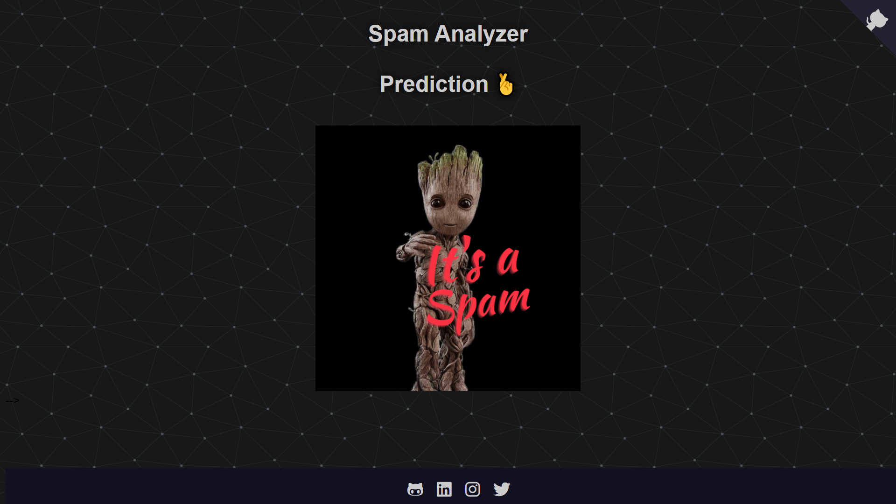

# Spam Analyzer


## About it:

Spam Analyzer is a web app based on _Machine learning for filtering out spam in the message._ To build the spam analyzer model, I used the dataset name ` SMS Spam Collection Dataset` available on Kaggle. This model has an accuracy of 97%.

**Directory Structure:**


## Model Building:

- I preprocessed the dataset which has only 5572 rows.
- After that I performed data visualization to get a better understanding of the dataset.
-  I've labeled(`del.Ham` and `spam`) all the rows to make a prediction.
-  I used `nltk.corpus` stopwords and Multimodal Naive Bayes Classifier to build the model.

## Building End-to-end Application

To build the end-to-end **Spam Analyzer**:
- Used `Flask` to build backend of the application.
- Used `HTML+CSS` to build the frontend of the application.
- Used `Heroku` to host the web application.

## Future Goals(May Be or May be not):

Will think about exploring low-resource models using this post-processed data.


## Getting started with this repo:
### 1. Prerequisites:
- Make sure that you've installed `git` and `python3`. If not then download [Python](https://www.python.org/downloads/source/) and [git](https://git-scm.com/downloads).

### 2. Get Code:
* Fork and then clone the [Spam Analyzer](https://github.com/divyanshugit/spam-analyzer):
  ```bash
  $ git clone https://github.com/YOUR-USERNAME/spam-analyzer
  ```
* Install the dependencies:
  ```bash
  $ pip install -r requirements.txt
  ```
### 3. Run on local server:
  ```python3
  $ flask run
  ```
<details><summary><b>Sneak Pics:</b></summary>

**Ham Check:**
<p float="left">
  
   
</p>

**Spam Check:**
<p float="left">
  
   
</p>
  
</details>

### Show some love 💖 by starring this repository

### Interesting Links:
- [Dataset](https://www.kaggle.com/uciml/sms-spam-collection-dataset)
- Blog coming soon.
